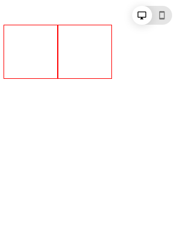
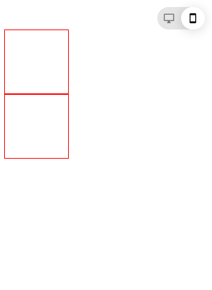

# Desktop/Mobile Switch
A HTML5 desktop/mobile switch CSS Only

## Preview

### Desktop




### Mobile




## Use

1. link [switch css](style.css) file
```html
<link rel="stylesheet" href="switch.css">
```

2. add switch controlers
```html
<input type="checkbox" id="switch">
<label for="switch" class="switch">
    <div class="toggle"></div>
    <div class="names">
        <i class="one material-icons">desktop_windows</i>
        <i class="two material-icons">smartphone</i>
    </div>
</label>
```

3. custom response
```css
[type="checkbox"]:checked~.content {
    flex-direction: column;
}
```
